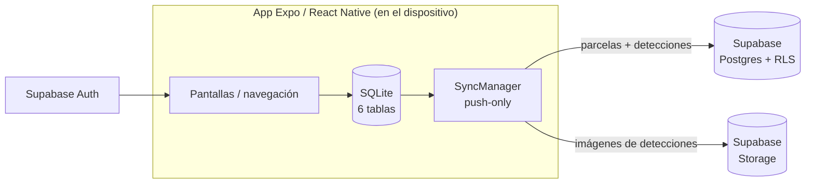

# AgroScanner

[English](README.md) · **Español**

App móvil offline-first para la **detección** fitosanitaria de enfermedades en
cultivos, pensada para agricultores de Colima, México. AgroScanner detecta
síntomas en los cultivos — no emite diagnósticos — y funciona sin internet: todo
se guarda en el dispositivo y se sincroniza con la nube solo cuando el usuario
decide compartir sus datos.

[](LICENSE)
[](https://expo.dev)
[](https://reactnative.dev)
[](https://expo.dev)

> **Módulo de ML en el dispositivo: en desarrollo.** El flujo completo de captura
> a historial es funcional, pero la clasificación de imágenes hoy devuelve un
> resultado simulado (`getResultadoSimulado()` en `CamaraScreen.tsx`). Un módulo
> MobileNetV3/TFLite lo reemplazará — plan y métricas en
> [`ml-model/`](ml-model/README.md).

## Capturas

<table>
  <tr>
    <td align="center"><br><sub>Inicio</sub></td>
    <td align="center"><br><sub>Selección de cultivo</sub></td>
    <td align="center"><br><sub>Cámara integrada</sub></td>
  </tr>
  <tr>
    <td align="center"><br><sub>Resultado de la detección</sub></td>
    <td align="center"><br><sub>Pin sobre la parcela</sub></td>
    <td align="center"><br><sub>Historial de detecciones</sub></td>
  </tr>
  <tr>
    <td align="center"><br><sub>Editor de parcela</sub></td>
    <td align="center"><br><sub>Detalle de detección</sub></td>
    <td></td>
  </tr>
</table>

## Funcionalidades

- **Núcleo offline-first:** base local SQLite (6 tablas, llaves foráneas, UUIDs) —
  escaneo, historial y parcelas funcionan sin conexión.
- **Cámara real:** `expo-camera` con flash, importación desde galería y manejo de
  permisos; las imágenes se guardan en el almacenamiento persistente de la app.
- **Gestión de parcelas:** dibuja el polígono de tu parcela tocando la pantalla;
  el área se calcula en tiempo real (m² / ha) con matemática GeoJSON de `turf.js`.
- **Detecciones georreferenciadas:** coloca un pin dentro del polígono; los
  metadatos GPS se capturan con `expo-location`.
- **Autenticación:** Supabase Auth con respaldo offline hacia la sesión local;
  modo invitado (2 pestañas) guarda todo localmente y nunca sube datos.
- **Sincronización push-only:** `SyncManager` sube parcelas y detecciones
  pendientes (con imágenes a Supabase Storage) cuando vuelve la conexión.
  Reintentos con backoff exponencial (1s / 4s / 16s). Solo se ejecuta si el
  usuario aceptó compartir datos (`compartir_datos = 1`); los datos de invitado
  nunca salen del dispositivo.
- **Historial de detecciones:** filtros por cultivo, detalle con nivel de riesgo,
  confianza y tratamiento sugerido.
- **Pestaña de mapa:** estadísticas por parcela de detecciones sanas/enfermas. El
  mapa de calor visual es parte de la fase de Mapbox.

## Arquitectura



- **Local primero:** toda acción se escribe en SQLite y se marca `sincronizado = 0`.
- **Auth:** Supabase Auth (JWT) replicado en SQLite; si no hay red, la app usa la
  sesión local como respaldo.
- **Sync:** se dispara con un listener de `NetInfo` y tras iniciar sesión. Cada
  fila pendiente se sube y se marca como sincronizada; las imágenes van al bucket
  `detecciones` y la URI local se reemplaza por la URL pública.
- **Esquema en la nube:** [`supabase/schema.sql`](supabase/schema.sql) contiene
  las tablas, las políticas RLS y el bucket de Storage que usa la app.

## Stack técnico

| Capa | Tecnología |
| --- | --- |
| Framework | React Native 0.86 + Expo SDK 57 (TypeScript) |
| UI | Tamagui v2 + iconos Lucide + iconos SVG de cultivos |
| Navegación | React Navigation 7 (Stack + tabs condicionales) |
| Base local | `expo-sqlite` (offline-first) |
| Nube | Supabase (Postgres + Auth + Storage) |
| Cámara / medios | `expo-camera`, `expo-image-picker`, `expo-media-library` |
| Geolocalización | `expo-location` |
| Geometría geoespacial | `@turf/turf` (área, centroide, GeoJSON) |
| Mapas | Mapbox (planeado) |
| ML (en desarrollo) | MobileNetV3 en el dispositivo (TensorFlow Lite) |

## Cómo empezar

Requisitos: Node.js 18+, npm y la app Expo Go (Android/iOS).

```bash
git clone https://github.com/IanOlave0/agroscanner.git
cd agroscanner/frontend/AgroScannerApp
npm install
cp .env.example .env   # coloca tus credenciales de Supabase
npx expo start
```

Configuración de la nube (opcional para el modo invitado):

1. Crea un proyecto en [supabase.com](https://supabase.com).
2. Ejecuta [`supabase/schema.sql`](supabase/schema.sql) en el SQL Editor.
3. Copia la URL del proyecto y la anon key en tu `.env`.

Sin credenciales de Supabase la app igual funciona: modo invitado, escaneo,
parcelas e historial son totalmente locales.

> La fase de Mapbox requiere un dev client personalizado — `@rnmapbox/maps` no
> funciona en Expo Go. Notas de build en `AGENTS.md`.

## Estructura del proyecto

```
agroscanner/
├── frontend/AgroScannerApp/   # App Expo / React Native (TypeScript)
│   └── src/
│       ├── database/          # esquema SQLite, seed y consultas
│       ├── screens/           # auth, main, scanner, parcelas, historial, mapa
│       ├── sync/              # SyncManager (push offline-first)
│       ├── auth/ + context/   # Supabase Auth + AuthContext
│       ├── utils/             # utilidades de geometría con turf.js
│       └── constants/         # tokens de diseño
├── ml-model/                  # módulo de ML en el dispositivo (en desarrollo)
├── supabase/schema.sql        # esquema en la nube: tablas + RLS + storage
└── docs/screenshots/          # capturas para el README
```

## Roadmap

| Hito | Estado |
| --- | --- |
| UI + SQLite + flujo de escaneo simulado | ✅ |
| Flujos invitado/auth con tabs condicionales | ✅ |
| Cámara real + registro asistido por GPS | ✅ |
| Supabase Auth (con respaldo offline) | ✅ |
| SyncManager (push offline-first) | ✅ |
| Mapas offline con Mapbox + heatmap de detecciones | 🚧 planeado |
| Panel de administración + mapa de calor regional | 🚧 planeado |
| Módulo de ML en el dispositivo (MobileNetV3) | 🚧 en desarrollo |

## Contribuciones

Issues y pull requests son bienvenidos. Antes de enviar un PR, ejecuta:

```bash
npx tsc --noEmit
```

## Licencia

[MIT](LICENSE) © The AgroScanner Contributors.

## Créditos

Desarrollado por estudiantes del **TecNM — Instituto Tecnológico de Colima**.

Contribuidores: Ian Olave · Carlos Ramírez.
