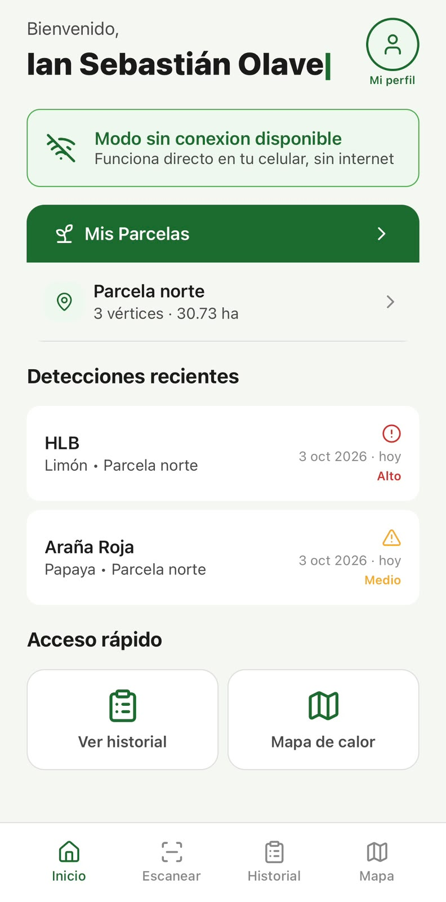
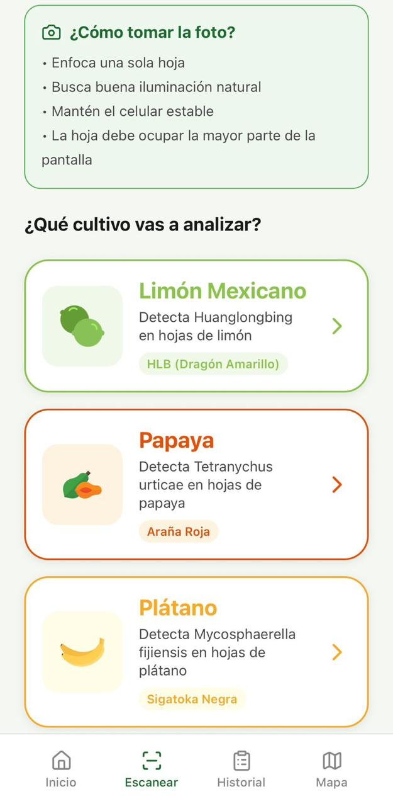
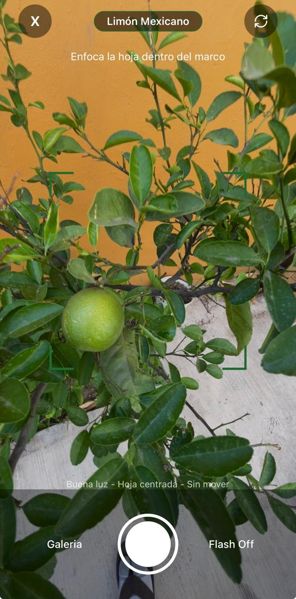
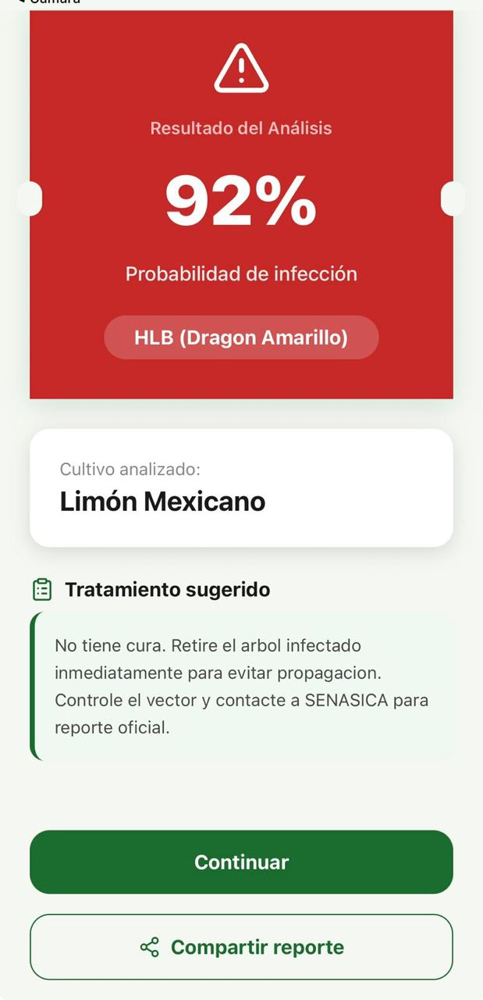
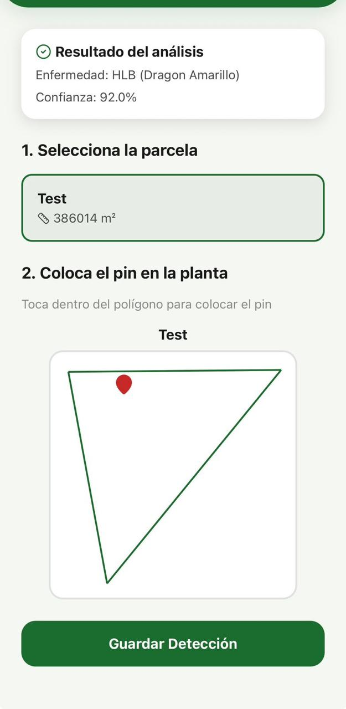
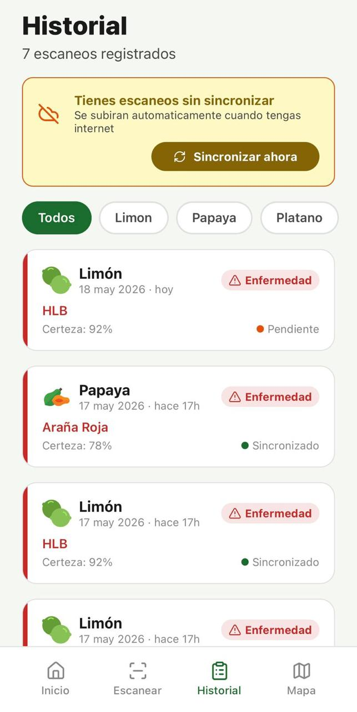
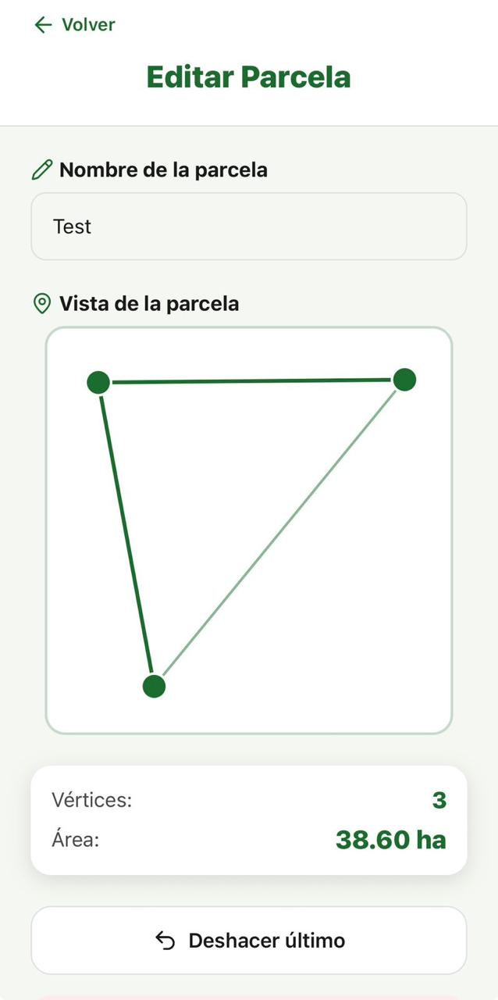
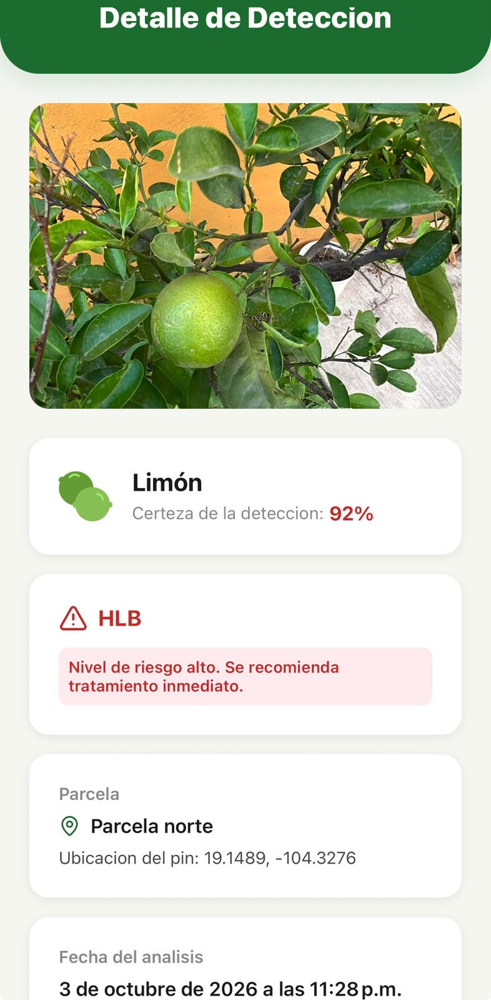
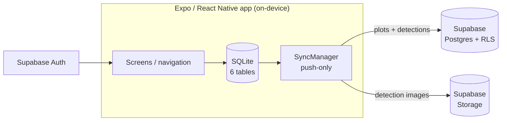

# AgroScanner

**English** · [Español](README.es.md)

Offline-first mobile app for phytosanitary **detection** of crop diseases, built for
farmers in Colima, Mexico. AgroScanner detects crop symptoms — it does not issue
diagnoses — and works without internet: everything is stored on-device and synced
to the cloud only when the user chooses to share data.

[](https://github.com/IanOlave0/agroscanner/actions/workflows/ci.yml)
[](LICENSE)
[](https://expo.dev)
[](https://reactnative.dev)
[](https://expo.dev)

> **On-device ML module in development.** The capture-to-history flow is fully
> functional, but image classification currently returns a simulated result
> (`getResultadoSimulado()` in `CamaraScreen.tsx`). A MobileNetV3/TFLite module
> will replace it — see [`ml-model/`](ml-model/README.md) for the plan and metrics.

## Screenshots

<table>
  <tr>
    <td align="center"><br><sub>Home dashboard</sub></td>
    <td align="center"><br><sub>Crop selection</sub></td>
    <td align="center"><br><sub>In-app camera</sub></td>
  </tr>
  <tr>
    <td align="center"><br><sub>Detection result</sub></td>
    <td align="center"><br><sub>Pin placement on plot</sub></td>
    <td align="center"><br><sub>Detection history</sub></td>
  </tr>
  <tr>
    <td align="center"><br><sub>Plot editor</sub></td>
    <td align="center"><br><sub>Detection detail</sub></td>
    <td></td>
  </tr>
</table>

## Features

- **Offline-first core:** local SQLite database (6 tables, foreign keys, UUIDs) —
  scanning, history and plots work with no connection.
- **Real camera capture:** `expo-camera` with flash, gallery import and permission
  handling; images are stored in the app's persistent storage.
- **Plot management:** draw plot polygons by tapping the screen; area is computed
  in real time (m² / ha) with `turf.js` GeoJSON math.
- **Georeferenced detections:** place a pin inside the plot polygon; GPS metadata
  is captured with `expo-location`.
- **Authentication:** Supabase Auth with an offline fallback to the local session;
  guest mode (2 tabs) stores everything locally and never uploads.
- **Push-only sync:** `SyncManager` uploads pending plots and detections (with
  images to Supabase Storage) when connectivity returns. Retries with
  exponential backoff (1s / 4s / 16s). Only runs when the user opts in to share
  data (`compartir_datos = 1`); guest data never leaves the device.
- **Detection history:** filters by crop, detection detail with risk level,
  confidence and suggested treatment.
- **Map tab:** per-plot statistics of healthy/diseased detections. Visual heatmap
  is part of the Mapbox roadmap phase.

## Architecture



- **Local first:** every action is written to SQLite and marked `sincronizado = 0`.
- **Auth:** Supabase Auth (JWT) mirrored to SQLite; if the network is down, the
  app falls back to the local session token.
- **Sync:** triggered by a `NetInfo` listener and after login. Each pending row is
  uploaded and marked as synced; images are uploaded to the `detecciones` bucket
  and the local URI is replaced by the public URL.
- **Cloud schema:** [`supabase/schema.sql`](supabase/schema.sql) contains the
  tables, Row Level Security policies and storage bucket used by the app.

## Tech stack

| Layer | Technology |
| --- | --- |
| Framework | React Native 0.86 + Expo SDK 57 (TypeScript) |
| UI | Tamagui v2 + Lucide icons + custom SVG crop icons |
| Navigation | React Navigation 7 (Stack + conditional bottom tabs) |
| Local database | `expo-sqlite` (offline-first) |
| Cloud | Supabase (Postgres + Auth + Storage) |
| Camera / media | `expo-camera`, `expo-image-picker`, `expo-media-library` |
| Geolocation | `expo-location` |
| Geospatial math | `@turf/turf` (plot area, centroid, GeoJSON) |
| Maps | Mapbox (planned) |
| ML (in development) | MobileNetV3 on-device (TensorFlow Lite) |

## Getting started

Requirements: Node.js 18+, npm, and the Expo Go app (Android/iOS).

```bash
git clone https://github.com/IanOlave0/agroscanner.git
cd agroscanner/frontend/AgroScannerApp
npm install
cp .env.example .env   # fill in your Supabase credentials
npx expo start
```

Cloud setup (optional for guest mode):

1. Create a project at [supabase.com](https://supabase.com).
2. Run [`supabase/schema.sql`](supabase/schema.sql) in the SQL Editor.
3. Copy the project URL and anon key into your `.env`.

Without Supabase credentials the app still runs: guest mode, scanning,
plots and history are fully local.

> The Mapbox phase requires a custom dev client — `@rnmapbox/maps` does not work
> in Expo Go. See `AGENTS.md` for build notes.

## Project structure

```
agroscanner/
├── frontend/AgroScannerApp/   # Expo / React Native app (TypeScript)
│   └── src/
│       ├── database/          # SQLite schema, seed and queries
│       ├── screens/           # auth, main, scanner, plots, history, map
│       ├── sync/              # SyncManager (offline-first push)
│       ├── auth/ + context/   # Supabase Auth + AuthContext
│       ├── utils/             # turf.js geometry helpers
│       └── constants/         # design tokens
├── ml-model/                  # on-device ML module (in development)
├── supabase/schema.sql        # cloud schema: tables + RLS + storage
└── docs/screenshots/          # README screenshots
```

## Roadmap

| Milestone | Status |
| --- | --- |
| UI + SQLite + simulated scan flow | ✅ |
| Guest/auth flows with conditional tabs | ✅ |
| Real camera + GPS-assisted registration | ✅ |
| Supabase Auth (offline fallback) | ✅ |
| SyncManager (offline-first push) | ✅ |
| Mapbox offline maps + detection heatmap | 🚧 planned |
| Admin dashboard + regional heatmap | 🚧 planned |
| On-device ML module (MobileNetV3) | 🚧 in development |

## Contributing

Issues and pull requests are welcome. Before submitting a PR, please run:

```bash
npx tsc --noEmit
```

## License

[MIT](LICENSE) © The AgroScanner Contributors.

## Credits

Developed by students at **TecNM — Instituto Tecnológico de Colima**.

Contributors: Ian Olave · Carlos Ramírez.
